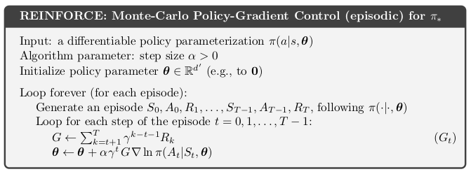

<h1 align="center"> Intelligence Group, COPS IIT(BHU) </h1>
<h2 align="center"> AI exercise </h2>

 April 2021 

# 1. About

This can be considered the official selection test for the next batch of the Machine Learning group, renamed as the **Intelligence Group or (IG), COPS IIT(BHU)**. 

1. Consider machine learning as a tool. If you know how to use it, but have never used it, what’s the point? This Exercise forces you to use ML to solve problems.
2. This Exercise will not be graded in any sense. But we will get to know you personally depending on the **technical questions you ask in chat**, and ofcourse the **quality of work** you present at the end. This will help us in evaluating your interest and knowledge.
3. After completing the exercise, you will have a clear understanding of the discussions we have in our group, and will be able to contribute too.
4. The ideas that you come up with while solving the Exercise are **yours!** We won’t take credit for it. You can develop that idea into a well drafted **project or publication** if you want.
5. The Exercise is long and has a very comfortable deadline. So make sure you are having fun.
6. If you have any doubts first try to Google it, if still not clear you can contact us personally or in the group. See the last section of this exercise for details. 
7. The deadline for the submission is **30th April 2021**.

 

#  2. Pre-requisites

All the resources required for completing the exercise are given in the [AI-roadmap](https://github.com/COPS-IITBHU/AI-roadmap). The exercise is made assuming that you have at least completed the Stanford courses on NLP, RL, and CV ([here](https://github.com/COPS-IITBHU/AI-roadmap#211-stanfords-courses-for-nlp-cv-rl)).

 

# 3. Exercise

The Exercises are structured such that you can either solve **any two** out of the first seven questions **OR** do the 

[last question](#3.8-Paper-Implementation) individually. Keep in mind that solving the last question means replicating state-of-the-art results of a paper.

 

## 3.1 Numpy neural network (topic: general)

In this question, you will create a neural net in NumPy which either computes the xor or the xnor of two one bit binary numbers depending on the value of a third input. If the third input is 0, the neural net should compute the xor of the two numbers and if the third input is 1, the neural net should compute the xnor of the two numbers.

|  X1 (first bit) | X2 (2nd bit) |    X3 (task)    |       Y        |
|:---------------:|:------------:|:---------------:|:--------------:|
| 0               | 0            | 0               | 0              |
| 0               | 1            | 0               | 1              |
| 1               | 0            | 0               | 1              |
| 1               | 1            | 0               | 0              |
| 0               | 0            | 1               | 1              |
| 0               | 1            | 1               | 0              |
| 1               | 0            | 1               | 0              |
| 1               | 1            | 1               | 1              |

 

Initialize the network with random parameters. Then, use the above table as the training dataset for your neural network.

> **Goal:** To have a clear understanding of the matrix operations involved in backpropagation.  
> **Prerequisites:** Neural Networks, back propagation, matrix calculus, numpy  
> **Instructions for submission:** All submissions to be made as ready-to-run jupyter notebooks, which are directly executable in google colab.  

 

## 3.2 Optimizer study (topic: general)

In this question you will have to study different optimizers (SGD, Adam, Rectified Adam, Adagrad, RMSProp, etc). Create and train a simple neural network (keep your network complex enough to see the difference in optimizer performance e.g. Resnets) and study the convergence of this network using different optimization methods. Write your optimizers from scratch and try to mimic the purpose for which they were created. The idea is to study different optimization methods. Don’t limit yourself to just the optimizers given above, you may also explore different optimization methods given in the [http://www.deeplearningbook.org/](http://www.deeplearningbook.org/).

Finally, prepare a small 1-3 page report of your findings, with diagrams 

**Note:** If done properly, this work could form an excellent project or the building blocks of a publication.

> **Goal:** To have a clear understanding of the types of optimizers used in neural networks, and their strengths and weaknesses.  
> **Prerequisites:** Gradient descent, Backpropagation, types of optimizers.  
> **Instructions:** All code needs to be either submitted as a zip file, containing clearly named .py files, or as a single jupyter notebook directly executable on google colab  

 

## 3.3 Word Embeddings (topic: NLP)

Download the Large Movie Review Dataset from Stanford [[Link](http://ai.stanford.edu/~amaas/data/sentiment/)]. Extract all the sentences out of the dataset. 

1. Now make a model which will learn the word embeddings of all the words present in this dataset. There is no limitation as to which model you use for developing the embeddings. You have to make the model in Numpy(suggested) or pytorch. Most commonly used are word2vec, glove and fastText. Keep in mind that you have to write down and train the model. Using an api which directly returns the embedding, does not count as completing the question. 
2. Optional task: Once done with static word embeddings, you can proceed to make a model that returns contextualised word embeddings. Again you can build any model of your choice. No restrictions on using static embeddings from your previous model but pretrained weights from the internet should not be used. Common approaches are elmo and CoVe. 

After learning the word embeddings (word vectors) visualise the embeddings using manifold learning algorithms. (Hint:t-SNE) You can directly use the algorithm by importing from sklearn or any other library for the visualization task.

You can learn more about word embeddings from Stanford’s 224n [[Link](http://web.stanford.edu/class/cs224n/syllabus.html)] course or from the skymind.ai word2vec tutorial.

 

## 3.4 Image Generation (topic: CV)

Train a generative adversarial network to generate images using the CIFAR10 dataset. There is no limitation to the kind of GAN you train. Report two results: One should be a baseline for your second result, and the second should be an optimisation or training technique which helped in stabilising your training of the GAN and trained it better.

 

## 3.5 Semantic Segmentation (topic: CV)

Semantic Segmentation is widely used from self driving cars to robot manipulations. The main baseline architecture used for doing so is U-Nets. We want you to train a UNet for autonomous cars using the Cityscapes dataset [[link]](https://www.kaggle.com/dansbecker/cityscapes-image-pairs). The following link also accompanies many starter codes for you to get started. We expect you to apply the vanilla UNet(But a better architecture is always welcome) and submit a Report describing the insights you gained about the Trained UNet. This should at least contain the following 2 points. 

*   Activations due to images in the Step Down network using HeatMaps [[reference]](https://keras.io/examples/vision/grad_cam/)
*   t-SNE analysis of the latent space for different classes and for the objects in different regions of the image.

You may lower the number of classes than given in the dataset (minimum is 3 classes, vehicles are compulsory).

 

## 3.6 REINFORCE (topic: RL)

The figure below is a popular baseline reinforcement learning algorithm. It uses the policy gradient step to come up with an optimal policy. In almost any reinforcement learning course, you will surely find the following algorithm mentioned.

The goal of this task is to make sure you have a clear understanding of the algorithm, which will form the basis of your understanding of policy gradient approaches in RL.	

Hence, we would like you to implement this algorithm (shouldn't take longer than 100 lines if you use Pytorch), and test it out on the following environments (all are discrete action space):

1. Mountain Car: [https://gym.openai.com/envs/MountainCar-v0/](https://gym.openai.com/envs/MountainCar-v0/)
2. CartPole: [https://gym.openai.com/envs/CartPole-v0/](https://gym.openai.com/envs/CartPole-v0/)
3. Acrobot: [https://gym.openai.com/envs/Acrobot-v1/](https://gym.openai.com/envs/Acrobot-v1/)
4. LunarLander: [https://gym.openai.com/envs/LunarLander-v2/](https://gym.openai.com/envs/LunarLander-v2/)
5. Pong: [https://gym.openai.com/envs/Pong-v0/](https://gym.openai.com/envs/Pong-v0/) (optional)
6. Grid world: [https://github.com/maximecb/gym-minigrid](https://github.com/maximecb/gym-minigrid) (optional)

 

## 3.7 Q learning (topic: RL)
 

1. Implement a reinforcement learning algorithm, say DQN (though you can choose any other algorithm as well) for multiple agents in Petting Zoo’s multi-agent Simple Adversary environment [[Link]](https://www.pettingzoo.ml/mpe/simple_adversary). Note that in this problem you are expected to simultaneously train multiple agents. Report two results: First, the behaviour of the agents and what change in hyperparameters led to new behaviours, and second, the reason why you think your training converged or diverged. You can try increasing the number of agents, to find any interesting variations of the algorithm’s performance.
2. Finally, make a report (2-3 pages) explaining your results, (or just illustrating your observations) with plots from your experiment.

 

## 3.8 Paper Implementation

If you’re attempting this question your task is to implement a deep learning paper. Select any one of the papers published in NeurIPS 2020. First read the abstract and give a rough reading of the paper you have chosen. At this point inform us that you’re attempting to implement the paper and tell us about the paper chosen. Once you get an approval from us you can go ahead and give a thorough reading of the paper and try implementing the paper using pytorch.

We are not expecting you to write a very clean implementation but will be testing you on your understanding of the paper. Your code should be able to replicate results described in the paper.

Remember this task has not been designed for beginners but anyone is welcome to give it a try.

 

# 3. Timeline

It is preferred if you start working on the tasks along with auditing the AI-roadmap. Here’s a rough timeline we’d like you to follow:

### Week 1:

Read the exercise thoroughly, and start auditing either the NLP (CS224n) or the CV (CS231n) stanford course. This will be easier to follow than the RL courses. You can also go through the other resources in the AI-roadmap.

### Week 2:

By now, you should have decided the 2 tasks of your choice or the paper you would like to implement. By the end of week 2, we expect that you should have completed at least three-fourths of the NLP/CV stanford course. Hence, you can comfortably begin working on the tasks. 

### Week 3: 

By the end of this week, we expect a submission for one of the tasks. (if you are implementing the paper, you should have read the paper completely, and should have a rough implementation ready). 

### Week 4:

Try to wrap up the 2nd task, or the paper implementation. Get your reports ready. 

 

# 4. Submission

All tasks require submissions in the form of code or reports. We will provide clear instructions on how to submit towards the end of the month. However, we encourage you to **keep us informed of your progress**, especially when you have completed a task.

 

# 5. Contact Info

If you have any questions/suggestions or need guidance on anything, make sure to raise a question in the group. We have also provided our whatsapp numbers for specific doubts regarding the exercise. For technical doubts, just make sure that you have googled your questions before contacting us personally.

 

**Team -**

(NLP) **Aditya:** 9783041889 (discord: raven#6436)

(NLP) **Shravan:** 7975500284 (discord: BAJUKA#5562)

(CV) **Saaswath:** 7094172606 (discord: 8mann#5607)

(RL, CV, NLP) **Yash:** 7303260400 (discord: yashsahijwani#3996)

(RL, CV) **Ayush:** 8777878819 (discord: aksayushx#7751)

(RL, CV) **Somnath**: 7829287795, (discord: Hex-Plex0xff#3408) 

(RL, CV) **Vikhyath:** 8105975839 (discord: RotInHell08#6764)

(RL, CV) **Nishant**: 7665179120 (discord: nishantkr18#1847)
